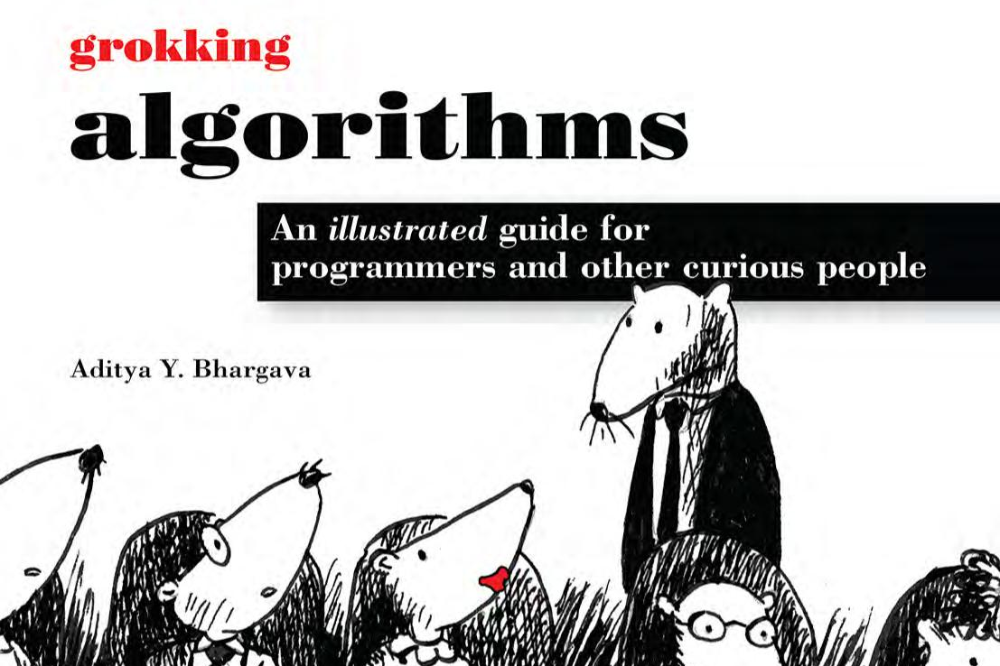

----
# Grokking Algorithms (and beyond)

In this repository I'll practice and implement all the algorithms I learned while reading the amazing book "Grokking Algorithms" by Aditya Y. Bjargava (and more).   

## For each of these algorithms I'll provide .:
- Explanation — the thought process.
- Use Case — where it can be useful.
- The algorithm implementation — written in [Typescript](https://www.typescriptlang.org/) and/or [C](https://en.wikipedia.org/wiki/C_(programming_language)).

## Official Repository .:
There's an [official repository](https://github.com/egonSchiele/grokking_algorithms) where they provide all the algorithms and resources, this is my own implementation for study purpose only.
